NSIS[^1]是一个软件打包工具，可以将所有程序打包成一个exe安装包，方便用户安装自己开发的软件。

## 使用方法

> 文章中的NSIS版本为:3.08，HM NIS Edit版本为2.0.3

1. 首先需要准备软件NSIS[^2]和HM NIS Edit[^4]。HM NIS Edit[^3]是NSIS脚本的一个生成工具，后面将会使用HM NIS Edit（后简写为Editor）来生成NSIS脚本。

2. 打开Editor，选择 文件->新建脚本-向导 （或按Ctrl+W）来打开向导。

3. 在第一页设置软件相关信息 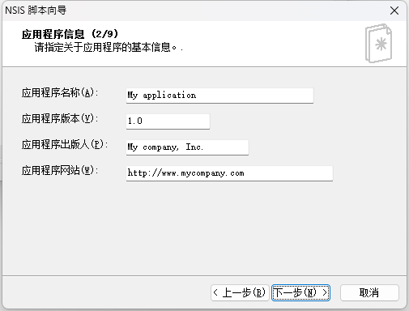

4. 第二页可以配置安装程序的图标和生成的位置，生成位置可以使用相对位置或绝对位置。安装程序语言可以根据自己的需要设置。 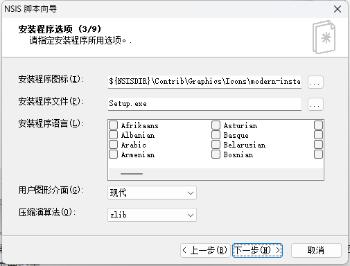

5. 在这一页配置软件的安装目录以及用户协议等。如没有用户协议，可以将授权文件那一栏清空，将不会生成用户协议页面。 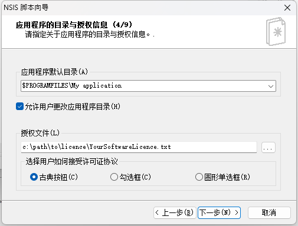 安装目录提供了一些常用变量 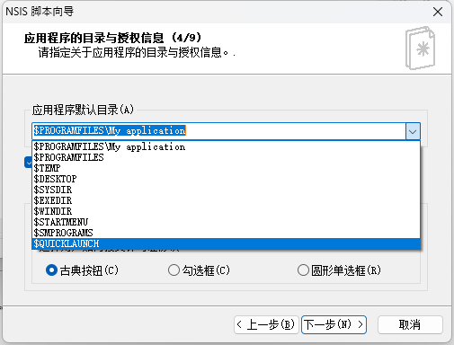 以下列举一些常用的目录变量
    - `$PROGRAMFILES`：为用户的ProgramFiles目录地址，在安装时会动态确定。在64位Windows系统中，`$PROGRAMFILES`会指向`X:\Program Files (x86)`[^5]，`$PROGRAMFILES64`会指向`X:\Program Files`。如果想要固定的安装到某一个文件夹，使用`$PROGRAMFILES32`或`$PROGRAMFILES64`变量。

    - `$COMMONFILES`：该目录一般都在`Program Files`目录下的`Common Files`文件夹内，这个地址的路径会在安装包运行时动态确定，因为本身在`Program Files`目录下，所以同`$PROGRAMFILES`一样有三个变量。

    - `$TEMP`：为系统临时目录地址，在运行时确定，一般为`X:\Users\[username]\AppData\Local\Temp`[^6]。

    - `$EXEDIR`, `$EXEFILE`, `$EXEPATH`：这三个分别为安装包所在的文件夹，安装包的名称（含扩展名），安装包的完整路径。

    - `$APPDATA`：AppData下的Roaming目录地址。这个常量对未安装IE4的Windows95系统或未安装活动桌面的Windows系统（一般出现在Windows Server上）无效。一般的位置为`X:\Users\[username]\AppData\Roaming`

    - `$LOCALAPPDATA`：AppData下的Local目录地址。这个常量对Windows 2000及以上版本有效。一般的位置为`X:\Users\[username]\AppData\Local`

    - `$WINDIR`：Windows目录地址。通常为`X:\Windows`

    - `$SYSDIR`：Windows下system目录地址。通常为`X:\Windows\system32`

    - 更多常量可以在[NSIS变量和常量详解](./0030.NSIS_Constant.md)中查看

6. 在这个页面**加入需要复制到用户电脑上的文件** 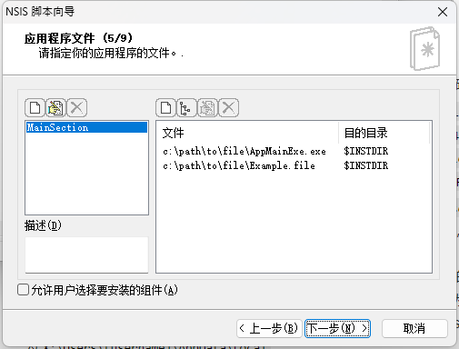 这个页面分为三个部分：左上部分为程序集，不同的程序集可以有不同的文件被添加到用户的电脑上，用户可以根据需要安装所需要的程序集；左下为该程序集的描述；右边为该程序集所包含的文件。 通过左上的三个按钮来分别添加/编辑/删除程序集以及程序集的名称。 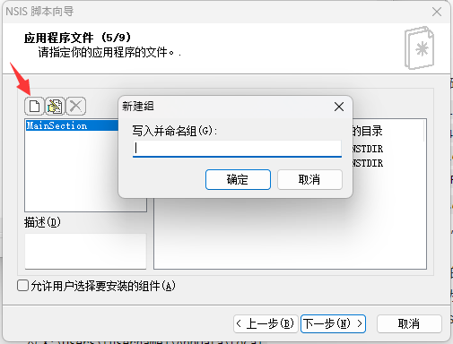 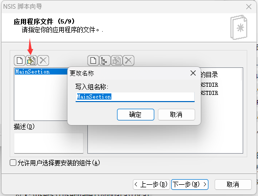 为某一个程序集添加文件时可以选择加入单个文件或一个文件夹的形式，以文件夹的形式添加时，会保留文件夹的目录层级。 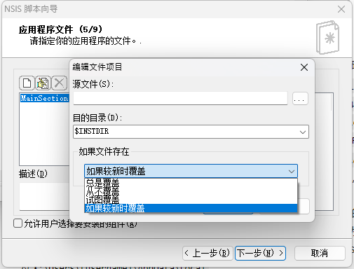 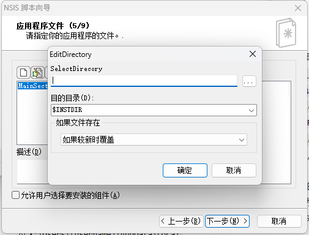 如上图所示，可以修改文件的覆盖方式，**但经过测试，Editor并不能很好的生成对应的脚本，后文会介绍如何修改成正确的脚本**。目的目录为该文件被释放的目录，向导提供了非常多的常量选项，在[NSIS变量和常量详解](./NSIS_Constant.md)中可以查看到这些内容。

7. 在该页中可以创建一些快捷方式。 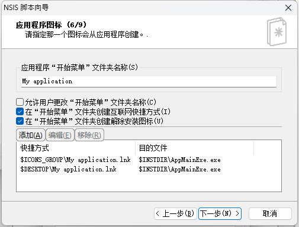

8. 在这个页面中可以设置安装后运行的程序。 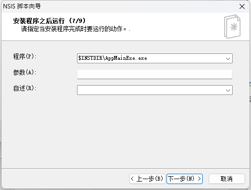 但经过测试，**无法在向导中禁用安装后运行的功能**，需要手动修改脚本。这个页面中的程序为安装后运行的程序，参数为传入程序的参数，自述可以是readme.txt一类的文本文件，用于描述一些信息

9. 在这里配置卸载程序，取消勾选“使用解除安装程序”将不会创建卸载文件 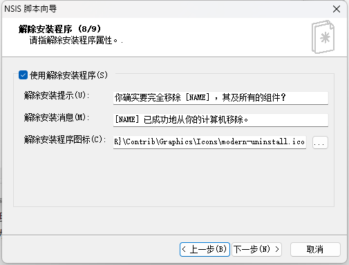

10. 最后结束配置 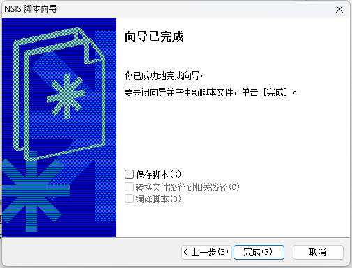 保存脚本会将生成的脚本保存到指定位置，可以转换文件路径到相对路径以保证可移植性。编译脚本将会直接调用NSIS生成对应的安装包。如果不保存脚本，脚本将只会在Editor中生成。

## 脚本修改

上文中提到，设置向导并不能完美的生成我们所需要的脚本，其中部分配置存在错误，因此需要手动调节脚本，下文将详细描述如何修改生成的脚本。

1. 修改文件覆盖方式。有时候生成的脚本中的文件覆盖方式与预期的不符，如设置为较新时覆盖，在脚本中却生成了`SetOverwrite try`，那么需要将`try`改为`ifnewer`。 `SetOverwrite`常用的几个参数为
    - `on`：始终覆盖
    - `off`：跳过（不覆盖）
    - `try`：覆盖可以写入的部分，不可写时跳过
    - `ifnewer`：只覆盖新文件

2. 禁用安装程序后运行。向导中默认是无法关闭安装程序后运行这个功能的，必须到脚本中修改。首先找到脚本中的`; Finish page`这一行，可以在后面的代码中看到定义了一个`MUI_FINISHPAGE_RUN`变量，变量后的值为结束后运行的程序，将该行注释或删除，就可以完全关闭安装后运行。

[^1]: 官网地址：[https://nsis.sourceforge.io/Main_Page](https://sourceforge.net/projects/nsis/)
[^2]: 下载地址：[https://sourceforge.net/projects/nsis/](https://sourceforge.net/projects/nsis/)
[^3]: 官网地址：[https://hmne.sourceforge.net/](https://hmne.sourceforge.net/)
[^4]: 下载地址：[https://sourceforge.net/projects/hmne/](https://sourceforge.net/projects/hmne/)
[^5]: X为系统的盘符，下文同
[^6]: [username]为用户名，下文同